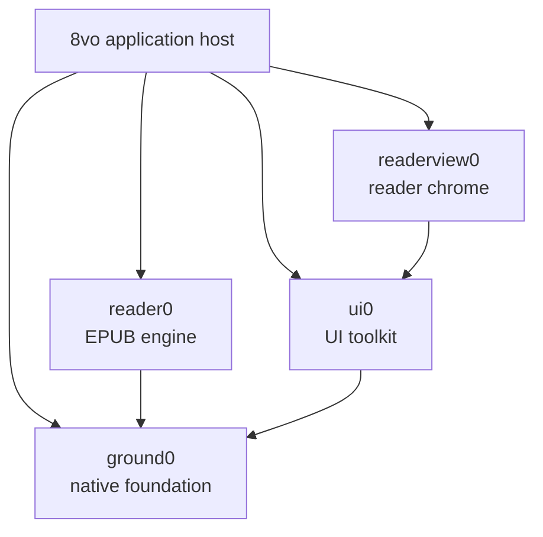

# 8vo architecture

8vo is a native reader with a format-neutral application shell. The working
product host is Windows and EPUB is its only document backend today. The
accepted Android host is at Port 7. Port 8 structural navigation is a candidate
with passing physical-device automation against Reader0 `0.7.0-dev` / API 7.
Its Reader0, dual-ABI Android, API 36 emulator, strict Windows 8vo, isolated
re10, API 34 ARM64 iQOO automation, and exact durable-data restore gates pass.
A controlled real-book structural jump/Return check also passed. Audible
TalkBack and subjective hands-on validation remain pending.
Port 7's Reader0, companion re10, exact 8vo guard/build, final emulator and
iQOO 36/36 matrices, ProcessRestart, 130% accessibility, crash, backup/restore,
and hands-on reader-quality closure remain accepted evidence.
It compiles the same exact shared sources, starts on an 8vo-owned bounded
library, opens its deterministic sample or multiple digest-keyed imported
EPUBs through Reader0, presents canonical borderless styled pages with
host-composited native chrome, supports
presentation-gated page, structural-navigation, history, progress-choice, and
appearance changes, offers host-owned global themes and system serif/sans
typography, and durably resumes each book's last successfully presented
semantic location.
The project does not introduce a generic document framework in anticipation of
formats that do not yet exist.

## System map



8vo compiles these libraries directly from the exact revisions recorded under
`vendor/`. The pins and bootstrap process are documented in
[DEPENDENCIES.md](../DEPENDENCIES.md).

## Responsibilities

| Component | Owns |
| --- | --- |
| **8vo** | Product lifecycle and input, the library surface, commands, persistence, document selection, rendering integration, accessibility adapters, and product cache policy; concrete Win32 production and Android native reader hosts |
| **reader0** | EPUB parsing, metadata, layout, pagination, search, selection, navigation, and canonical reader frames |
| **readerview0** | Shared reader chrome, panel and popup layout, transient interaction state, semantic records, and bounded actions |
| **ui0** | Product-neutral controls, focus and input mechanics, layout, themes, and renderer-independent draw records |
| **ground0** | Memory and OS primitives, files and atomic replacement, Unicode and text, fonts, presentation geometry, image decoding, draw commands, and software rendering |

The dependency direction is one-way. Reader0 does not depend on UI0 or
Readerview0. Readerview0 does not parse documents or perform persistent
mutations. Ground0 contains no reader-product policy.

## Application surfaces

8vo has two top-level surfaces:

- **Library** is owned entirely by 8vo. It stores a bounded, versioned catalog,
  imports and removes local books, and opens the native file picker. Cover and
  thumbnail policy remains future library work.
- **Reader** combines Reader0's canonical document frame with Readerview0's
  portable control/semantic projection. On Android, Port 7 asks Readerview0 for
  a distraction-free, borderless page over the full native viewport and draws
  equivalent controls in the Android host. Ordinary book entry starts with
  chrome hidden; only Activity recreation may restore transient visible chrome.
  Hidden chrome leaves the canonical SurfaceView at its identity transform.
  Visible chrome uniformly scales and translates that same already-rendered
  surface between Library/title/`Aa` and read-only progress; it has no visible
  Previous/Next buttons. Showing or hiding controls does not repaginate, redraw,
  or mutate the page. Closing a book returns to the Library.

Reader0 supplies EPUB metadata and resource access, but it does not own the
catalog. Readerview0 supplies the open-book interface, but it does not own the
document or host persistence.

## Frame flow

Each visible reader frame follows the same path:

1. Platform input is translated into host or reader intents.
2. 8vo applies host mutations or asks Reader0 to perform a document operation.
3. Reader0 publishes a canonical frame into caller-owned bounded storage.
4. 8vo projects that frame and host state into Readerview0.
5. Readerview0 returns UI0 draw records, semantic records, and requested
   actions.
6. 8vo validates and executes those actions, then adapts reader content and UI
   records to Ground0 presentation and rendering.
7. A successful capture and presentation completes the frame.

Android deliberately specializes the composition stage: Readerview0 still
supplies portable semantics and actions, while the host renders the native
controls and composes the canonical full-viewport page. This keeps pagination
and EPUB interpretation shared without forcing one platform's chrome layout
onto another platform.

Page navigation is gated by presentation: another page mutation cannot advance
until the accepted Reader0 frame has been captured and shown. Android taps,
horizontal swipes, virtual accessibility actions, and Page Up/Page Down or
D-pad Left/Right all enter that same native gate. The host classifies gestures
and clears Java/native touch state across chrome transitions, lifecycle,
surface replacement, and geometry changes; Reader0 remains the page-movement
authority. Key repeat, preparation scheduling, and cancellation remain
platform-host policy rather than Reader0 behavior.

Port 7 extends the same gate to appearance generations and canonical reflow.
Java coalesces rapid preference requests, native state permits only one page,
appearance, or reflow generation to await presentation, and the durable
appearance is not advanced until the native window has posted it successfully.

Port 8 extends that boundary to Contents and Go-to jumps, Return/Forward, and
progress-display changes. Reader0 API 7 owns EPUB 2/3 navigation interpretation,
canonical destination summaries, percentage and meaningful-page targets, and a
bounded platform-neutral history model. Android suppresses eager history while
a target is provisional and calls
`epub_reader_record_presented_navigation` with the actual presented anchor only
after its matching native frame is posted. History is session-bounded and
intentionally not durable. The per-book position and global progress choice are
durable, but advance only after successful presentation. Surface loss,
lifecycle interruption, render failure, or teardown leaves the last presented
state authoritative.

## Ownership and lifetimes

- Reader state, frame storage, UI state, layout inputs, arenas, and caches are
  caller-owned.
- Cross-package strings and rows are borrowed only for the current build.
- Public boundaries use values and bounded records, not callbacks, provider
  tables, virtual interfaces, or dependency injection.
- Reader0 is consumed through `reader0.h`, and `reader0.c` is compiled exactly
  once.
- Capacity failures and unsupported states remain visible to the caller.
- No package starts hidden threads or owns process-global mutable document
  state.

## Reader state and persistence

8vo owns reading settings, saved locations, bookmarks, highlights, and notes.
Readerview0 projects this state and returns requests; it never treats a request
as a completed mutation.

Persistent records are versioned and atomically replaced through the concrete
host: the Windows host uses Ground0's atomic-file mechanism, while Android
uses app-private same-directory temporary files, descriptor synchronization,
and atomic replacement where supported. Each file is replaced independently;
the application does not claim a cross-file transaction. Failed annotation
mutations restore the in-memory state and leave editable drafts available for
retry.

Android Port 7 stores exactly one global appearance in
`<files>/port7/appearance.v1`, separately from the Port 6 catalog and per-book
locations. The current version-3 fixed record has an explicit version, shape,
size bound, and CRC32 checksum. Missing, corrupt, or new appearance state falls
back to Paper, Literary system serif, 14sp, Classic spacing, Balanced width,
Publisher alignment, theme-safe publisher colors, and reduced motion off.
Loading a valid version-1 18sp default, version-2 16sp default, or transitional
version-2 18sp value returns a 14sp in-memory appearance while preserving every
other valid field, marks migration pending, and leaves the old bytes untouched.
The transitional value is a bounded pre-origin ambiguity: before explicit
choice-origin metadata, the version-2 writer could republish an inherited
version-1 18sp default after a non-font change. Inherited and explicit v2/18
origins cannot be distinguished, so the bounded policy migrates every v2/18
record. Version-2 21/24/28sp choices and every valid version-3 record remain
exact. Because 14sp was not in either old schema, a version-1 or version-2
record carrying it is invalid. Per-book appearance overrides are deliberately
absent.

The Activity publishes pending v3/14sp state only after the first successfully
accepted reader frame; a library-only launch cannot rewrite it. Publication
requires a synchronized same-directory temporary file and `ATOMIC_MOVE` with
`REPLACE_EXISTING`. Unsupported or failed atomic publication preserves the old
bytes, keeps migration pending, visibly reports the save failure, and retries
after a later successfully accepted presentation. There is no non-atomic
fallback.

Windows application data lives under `%LOCALAPPDATA%\8vo`. Migration from
the former `lectern0` directory is handled by the Windows host and is designed
to be safe and idempotent. Android uses its package-private files directory.

## Layout and rendering

Readerview0 resolves the viewport, page surface, and content rectangle as one
layout result. The content rectangle is the authoritative input to Reader0
pagination, so presentation and document layout cannot silently disagree. The
Android Port 7 distraction-free projection resolves one borderless canonical
page against the full native viewport. Transient host-chrome transforms never
feed a smaller rectangle back into pagination.

Reader0 owns canonical text and image rows. Ground0 owns text shaping,
presentation geometry, image decoding and resampling, draw commands, and the
software renderer. 8vo connects them and owns:

- font and renderer bindings;
- decoded-image, prepared-image, and thumbnail cache limits;
- image fit and fallback policy;
- the final Win32 backbuffer or Android native-window presentation.

The same resolved font measurements are used for pagination and rasterization.
Images remain Reader0 document resources, Ground0 decoding mechanisms, and 8vo
presentation policy.

Publisher-aligned rows use one allocation-free 8vo justification planner from
`code/octavo_reader_justification.h` in both the Windows and Android raster
paths. It consumes validated Reader0 rows and presentation metrics; it does not
interpret EPUB content or paginate. Reader0 `0.7.0-dev`/API 7 retains the
authoritative API 6 `soft_wrapped` provenance in `EpubReaderFrameStyleRow`.
Measured space/em-dash wraps are true; final/hard-line and image boundaries are
false. Both hosts consume that field rather than inferring wrap state from text
bytes.
Eligible publisher-justified prose fills the available measure with widened,
overflow-safe exact-fill arithmetic. The raster paths exclude layout-only
trailing whitespace from measurement/drawing while preserving visible em-dash
ink. Ragged-right mode and intentional hard lines retain natural word spacing.
Windows theme IDs, labels, UI0 mappings, derived reader roles, and 8vo
search/highlight extensions similarly live in the stable shared
`octavo_theme` catalog. Android's six semantic palettes remain independently
tuned host policy, because cross-platform reuse does not require identical
platform colors.

Port 7 acquires Android's generic serif or sans-serif family in the host and
copies regular, bold, italic, and bold-italic sparse atlas metrics into caller-
owned native state. Atlas version 2 provides one sorted 233-codepoint map:
printable ASCII, U+00A0..U+00FF, and 42 curated publication characters. Native
lookup uses validated direct ASCII and Latin-1 paths with bounded binary-search
fallback and increments a missing-glyph diagnostic for an unmapped codepoint.
An immutable one-entry typography cache reuses the atlas for the same family,
resolved pixel size, and spacing tuple. No font asset is bundled, embedded EPUB
fonts remain disabled, and this bounded publication set is not full Unicode
shaping/fallback. Device font metrics may differ. The portability promise is
therefore the semantic location, not identical page numbering across devices.

Before a layout-affecting appearance mutation, 8vo retains the last
successfully presented Reader0 spine/byte anchor. It supplies the new font
metrics and content geometry to Reader0 and invokes Reader0's public canonical
location-navigation path to publish the page containing that anchor. The host
verifies containment only after the native window posts the frame. Theme-only
updates and overlay-chrome visibility do not change page geometry or
pagination.

Android Debug native compilation keeps symbols but uses `-O2`. First-frame
scheduling opens and restores the requested page before deferring whole-book
location summaries to bounded post-presentation work. Terminal summary
failure is visible but nonfatal, and presentation exhaustion cancels further
deferred polling. The Android raster path fills rows directly and removes a
redundant fill. Accepted-stage diagnostics partition geometry, native-window
lock, Reader0 build, fill, draw, unlock/post, and total time without recording
titles or content. The earlier post-feedback APK's exact-book evidence
identified lock and unlock/post as the dominant variable cost; that measurement
remains Port 7 evidence until the Port 8 API 7 consumer is rerun.

The current reader-entry clock starts at the first instruction of `showReader`
and ends after the first `ANativeWindow_unlockAndPost` whose frame passes all
native successful-presentation gates. It excludes input dispatch before
`showReader`, compositor display after buffer queueing, and the two Java frames
before cover removal. The strict emulator gate remains 1500ms. The historical
220ms result started inside native creation and is not comparable with this
boundary.
Before constructing the reader hierarchy, the Activity synchronously installs
a target-theme transition cover; it removes that cover only after a successful
native page and two Java frames, preventing the SurfaceView's initial black
layer from becoming visible.

## Platform and accessibility

8vo owns each platform's window or surface, lifecycle, input translation,
native file picker, fullscreen behavior, clipboard integration, and
accessibility adapter.

Readerview0 publishes portable semantic and focus records. 8vo exposes those
records through the Win32 MSAA object and adds its host-owned controls, such as
Close Book. Native object lifetime and execution of returned actions remain in
the application.

The Android Port 7 implementation candidate remains deliberately bounded.
Java owns the Activity, library and `OctavoAppearancePanel` settings surfaces,
standard document picker, digest-keyed managed copies, versioned catalog,
global appearance record, removal policy, system typography acquisition,
accessibility adapter, target-theme transition cover, minimal native chrome,
swipe/keyboard classification, SurfaceView scale/translation, and SurfaceView
lifecycle. The visible reader chrome has Library, title, single-tap `Aa`, and
read-only progress but no Previous/Next buttons. One caller-owned native handle
owns the corresponding ANativeWindow, Reader0/Readerview0 state, copied four-
style sparse glyph atlas, resolved semantic palette, canonical-page state, and
presentation gates.

The accepted Port 6 catalog remains capped at 64 entries and 128 KiB; each
import remains capped at 512 MiB. Duplicate bytes reopen the existing SHA-256
entry, while removal deletes only the app-private copy after the catalog
commit. Appearance persistence does not alter those catalog records.

8vo persists one Reader0 spine/page-start byte per book only after successful
presentation. Writes are debounced during reading and synchronously flushed at
lifecycle, surface, and reader teardown. Reader0's existing canonical location
navigation reconstructs the same page under the same layout and the page
containing the presented semantic anchor after a reflow. Android does not
reimplement pagination. A corrupt catalog falls back to the deterministic
sample, and a valid Port 5 imported session is migrated once when no Port 6
catalog exists.

The Port 7 custom-view accessibility adapter publishes a bounded hidden-chrome
virtual tree for page content, previous page, next page, and progress. Visible
chrome transfers the named path to Library, Reader appearance, the virtual page,
and read-only progress without introducing visible Previous/Next controls.
Page scroll/click actions and Page Up/Page Down or D-pad Left/Right keep
essential navigation available without swipe. The adapter maps Readerview0's
portable semantic records to Android nodes and actions, keeps a stable focus
order, and emits page-change events only after successful presentation. It
establishes the bridge pattern but does not yet claim full publication semantics
or accepted TalkBack behavior.

Android font acquisition, theme policy, touch navigation, overlay chrome,
lifecycle, inset handling, handset content geometry, library/catalog,
document selection, persistence, removal, accessibility adaptation, and
successful-presentation policy remain host responsibilities. Port 8 also keeps
the navigation sheet, input presentation, Back policy, focus, and durable
progress choice in the Android host without duplicating EPUB interpretation.
Thumbnails, cover-library expansion, full-text search, text selection,
bookmarks/highlights/notes workspace, per-book appearances, embedded fonts,
complete publication accessibility, full Unicode shaping, and synchronization
remain deferred. The current bounded contract is in
[`android_port8.md`](android_port8.md); accepted Port 7 detail remains in
[`android_port7.md`](android_port7.md).

## Adding another format

A future PDF, CBR, or other backend should begin as a concrete implementation
with explicit host ownership. Shared abstractions should be extracted only
after at least two working backends demonstrate a stable common contract.

The application shell may choose between concrete backends, but Reader0 should
not gain a speculative generic provider interface merely to anticipate them.

## Build and validation

The build uses C11 with `/W4 /WX` and runs dependency and architecture guards
before compilation. The public validation entry point is:

```powershell
powershell -NoProfile -ExecutionPolicy Bypass -File scripts\run_public_smoke.ps1
```

Detailed historical decisions and regression evidence are retained in the
[engineering archive](archive/README.md). They are not part of the current
architectural contract.

The current Port 8 Reader0 boundary is `0.7.0-dev` / public API 7. Its exact
local commit `58ec6d11575c36176eb85511759d39dc93acb78b` is pinned in
`vendor/reader0_dependency`. Reader0 strict validation and the 8vo/re10
consumer gates pass. API 7 adds shared structural destination summaries,
percentage and meaningful-page navigation, full-model current-section identity,
UTF-8 labels, and presentation-gated history while retaining the accepted
authoritative soft-wrap contract.

The accepted Port 7 ordered Android matrix was 36 tests: appearance store 9,
appearance 15, navigation 5, library 5, accessibility 1, and bootstrap 1.
ProcessRestart was a separate two-test driver. The Port 8 ordinary API 36
matrix passes 56/56; its separate force-stop restart driver, focused 130%
text/disabled-animation matrix, transition/performance checks, and crash review
also pass. Exact guards/audit, dual-ABI Android, strict Windows/public smokes,
Reader0, and isolated re10 pass. The API 34 ARM64 iQOO ordinary matrix also
passes 56/56 in 121.608 seconds, followed by its external restart driver and a
15/15 130%-text/disabled-animation run. The physical crash buffer remained
empty, device settings restored exactly, and all 26 durable files restored
byte-exact after the suite. A controlled private-book Contents jump and Return
also passed. Audible TalkBack and subjective physical review remain.

The completed API 6 pre-closure binary passed those 8vo build gates and its API
36 and iQOO matrices passed 33/33. Backup replay, restart, 130% accessibility,
crash review, focused justification, controlled 135ms Resume, zero missing
glyphs, and hidden chrome also passed. These records are historical because they
predate non-mutating v1/v2 load, accepted-frame-only v3 publication, visible
save-failure retry, and the additional appearance/reader-entry regressions. They
do not accept the current source.

The immediately preceding API 5 Reader0 commit
`f41bd1c86cdcb1ef463ecdae0ec6d139f5355871` passed its exact Ground0 guard,
dependency audit, MSVC `/W4 /WX` build, `--reader-core-smoke`, and
`--host-smoke`; its worktree was clean. The strict Windows 8vo build and all
seven public smokes passed against that historical boundary.

The historical companion re10 branch `android/port7-reader0-justification` at
`789de8410924cb184a0e7aa485bd27fc7a5a8ab4` advanced only that Reader0 pin,
retained re10's own UI0 and Readerview0 closure, and passed its strict
product/qualification `/W4 /WX` build. Its `--document_engine_smoke` passed with
four anchors, final spine 3, and hash `f3c13a55f0349720`; the worktree was
clean.

For that API 5 integration, the exact dependency guards and dual-ABI Android
build passed. On the API 36
x86_64 emulator, the authoritative ordered suite passed 33/33 with zero
failures, errors, or skips in 138.917 seconds of XML test time. The exact
API 5 migration tests passed under their then-current deterministic cases. A
later audit superseded the claim that the ignored phone backup itself was
version 1: its top-level appearance is transitional version 2 at 18sp. The
pre-closure API 6 historical migration result is recorded above. At emulated
iQOO geometry, the
exact private ignored EPUB diagnostic sampled five eligible ordinary non-final
rows with three or four gaps: the prior path left 79--175px residuals and the
API 5 path filled the exact 800/800 or 928/928 measures. The focused
diagnostic passed 1/1 in 7.902 seconds without tracking private text.

The still earlier post-feedback APK's API 36 33/33 result in 96.223
seconds, restart, 130% system-text, crash-buffer, visual, transition, and timing
evidence are historical. Its API 34 iQOO 33/33 result in 104.855 seconds,
restart, large-text, crash, visual, swipe, reopen, 140ms first open, 121ms
median warm reopen, and 102ms focused reopen are also historical. The older
borderless/performance binary's 27/27, 411ms, and native-only 220ms results and
the reserved-geometry iQOO 23/23 record remain separate superseded evidence.

The current Port 8 API 7 candidate has passed expanded instrumentation,
ProcessRestart, 8vo shared/desktop, Reader0/re10, large-text, crash,
accessibility, alternate-input/reduced-motion, navigation-transition, and
synthetic Resume-performance gates on the emulator, plus the physical iQOO
automation and exact restore gates. A controlled private-book
structural-navigation check also passed. Audible TalkBack and subjective
physical acceptance remain.
