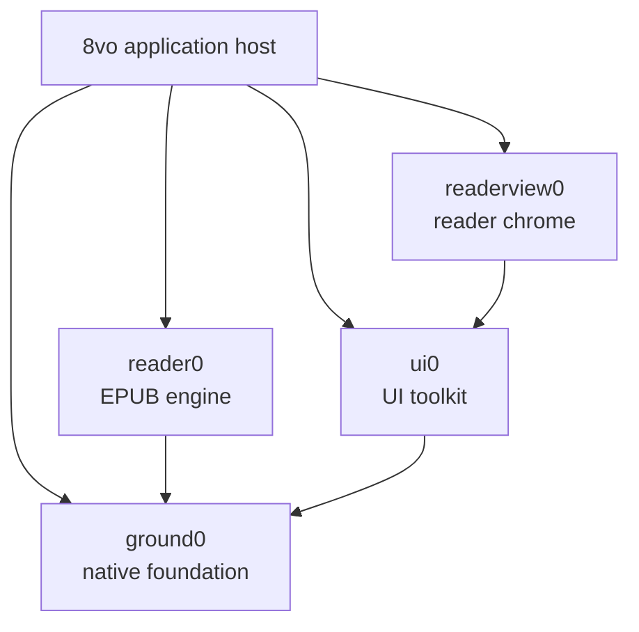

# 8vo architecture

8vo is a native reader with a format-neutral application shell. The working
product host is Windows and EPUB is its only document backend today. The
accepted Android host is at Port 7. Port 8 structural navigation is a candidate
against Reader0 `0.7.0-dev` / API 7 at
`5fe949d88258cd96884c44b69e4f4ab6f27dc394`. The corrected source closes six
reported navigation, pagination, image-page, chapter-targeting, and top-padding
defects and adds a prepared-frame media transaction. Earlier Port 8 emulator
and physical-device results are predecessor evidence. The corrected API 36
emulator and API 34 iQOO, external-restart, accessibility/reduced-motion, byte-
exact restore, and controlled real-book gates pass. Audible TalkBack, UI polish,
and user subjective/manual acceptance remain pending.
Port 7's Reader0, companion re10, exact 8vo guard/build, final emulator and
iQOO 36/36 matrices, ProcessRestart, 130% accessibility, crash, backup/restore,
and hands-on reader-quality closure remain accepted evidence.
Port 11's ninth local slice adds an API 36-accepted provider-neutral discovery
catalog and managed EPUB transfer/cleanup boundary. It remains disconnected
from providers, accounts, networks, permissions, cloud resources, and Play
Console state; physical-device and launch-security qualification are deferred.
It compiles the same exact shared sources, starts on an 8vo-owned bounded
library, opens its deterministic sample or multiple digest-keyed imported
EPUBs through Reader0, presents canonical borderless styled pages with
host-composited native chrome, supports
presentation-gated page, structural-navigation, history, progress-choice, and
appearance changes, offers host-owned global themes and system serif/sans
typography, and durably resumes each book's last successfully presented
semantic location.
The project does not introduce a generic document framework in anticipation of
formats that do not yet exist.

## System map



8vo compiles these libraries directly from the exact revisions recorded under
`vendor/`. The pins and bootstrap process are documented in
[DEPENDENCIES.md](../DEPENDENCIES.md).

## Responsibilities

| Component | Owns |
| --- | --- |
| **8vo** | Product lifecycle and input, the library surface, commands, persistence, document selection, rendering integration, accessibility adapters, and product cache policy; concrete Win32 production and Android native reader hosts |
| **reader0** | EPUB parsing, metadata, layout, pagination, search, selection, navigation, and canonical reader frames |
| **readerview0** | Shared reader chrome, panel and popup layout, transient interaction state, semantic records, and bounded actions |
| **ui0** | Product-neutral controls, focus and input mechanics, layout, themes, and renderer-independent draw records |
| **ground0** | Memory and OS primitives, files and atomic replacement, Unicode and text, fonts, presentation geometry, image decoding, draw commands, and software rendering |

The dependency direction is one-way. Reader0 does not depend on UI0 or
Readerview0. Readerview0 does not parse documents or perform persistent
mutations. Ground0 contains no reader-product policy.

## Application surfaces

8vo has two top-level surfaces:

- **Library** is owned entirely by 8vo. It stores a bounded, versioned catalog,
  imports and removes local books, opens the native file picker, and hosts the
  separate provider-neutral catalog-review and managed-transfer projections.
  A foreign-book offer's Back action durably records exact **Not now** state for
  its review epoch. Back from retained transfer, cleanup, or Retry UI only
  defers that modal: exact durable state remains unchanged, Library rows and Add
  EPUB become accessible, and a nonmodal attention action reopens the work.
  Cover and thumbnail policy remains future library work.
- **Reader** combines Reader0's canonical document frame with Readerview0's
  portable control/semantic projection. On Android, Port 7 asks Readerview0 for
  a distraction-free, borderless page over the full native viewport and draws
  equivalent controls in the Android host. Ordinary book entry starts with
  chrome hidden; only Activity recreation may restore transient visible chrome.
  Hidden chrome leaves the canonical SurfaceView at its identity transform.
  Visible chrome uniformly scales and translates that same already-rendered
  surface between Library/title/`Aa` and read-only progress; it has no visible
  Previous/Next buttons. Showing or hiding controls does not repaginate, redraw,
  or mutate the page. Closing a book returns to the Library.

Reader0 supplies EPUB metadata and resource access, but it does not own the
catalog. Readerview0 supplies the open-book interface, but it does not own the
document or host persistence.

## Frame flow

Each visible reader frame follows the same path:

1. Platform input is translated into host or reader intents.
2. 8vo applies host mutations or asks Reader0 to perform a document operation.
3. Reader0 publishes a canonical frame into caller-owned bounded storage.
4. 8vo projects that frame and host state into Readerview0.
5. Readerview0 returns UI0 draw records, semantic records, and requested
   actions.
6. 8vo validates and executes those actions, then adapts reader content and UI
   records to Ground0 presentation and rendering.
7. A successful capture and presentation completes the frame.

Android deliberately specializes the composition stage: Readerview0 still
supplies portable semantics and actions, while the host renders the native
controls and composes the canonical full-viewport page. This keeps pagination
and EPUB interpretation shared without forcing one platform's chrome layout
onto another platform.

Page navigation is gated by presentation: another page mutation cannot advance
until the accepted Reader0 frame has been captured and shown. Android taps,
horizontal swipes, virtual accessibility actions, and Page Up/Page Down or
D-pad Left/Right all enter that same native gate. The host classifies gestures
and clears Java/native touch state across chrome transitions, lifecycle,
surface replacement, and geometry changes; Reader0 remains the page-movement
authority. Key repeat, preparation scheduling, and cancellation remain
platform-host policy rather than Reader0 behavior.

Port 7 extends the same gate to appearance generations and canonical reflow.
Java coalesces rapid preference requests, native state permits only one page,
appearance, or reflow generation to await presentation, and the durable
appearance is not advanced until the native window has posted it successfully.

Port 8 extends that boundary to Contents and Go-to jumps, Return/Forward, and
progress-display changes. Reader0 API 7 owns EPUB 2/3 navigation interpretation,
canonical destination summaries, percentage and meaningful-page targets, and a
bounded platform-neutral history model. Android suppresses eager history while
a target is provisional and calls
`epub_reader_record_presented_navigation` with the actual presented anchor only
after its matching native frame is posted. History is session-bounded and
intentionally not durable. The per-book position and global progress choice are
durable, but advance only after successful presentation. Surface loss,
lifecycle interruption, render failure, or teardown leaves the last presented
state authoritative.

Port 8 media uses the same transaction. Reader0 owns frame-image resource
identity, image-only synthetic anchors, in-flow placement, and `visual_units`
height. The Android Java bridge serially retrieves bounded encoded bytes and
uses `BitmapFactory`. Reader0 stats each selected ZIP entry in the same opened
archive and rejects a declaration above the remaining encoded-byte allowance
before caller-arena output allocation or entry decompression. The distinct
limit result alone becomes Android's non-null empty-array `CacheFull` sentinel;
missing and corrupt entries remain isolated decode failures. Native owns
explicit loaded/terminal status, a
deterministic 32-entry/32-MiB ARGB LRU, current-frame pinning, aspect fit,
fallback, painting, and presentation rejection while any resource-backed image
remains unavailable. In addition to per-resource dimension/pixel bounds, each
Java preparation transaction caps cumulative encoded input at 16 MiB and
cumulative decoded input at 8,388,608 pixels. Exhaustion terminally marks that
resource and every remaining unavailable resource `CacheFull` without starting
another decode.

The Windows 8vo image host also adopts the shared bounded getter with its
existing 32 MiB encoded-resource ceiling. Reader0's strict smoke covers a
highly compressible oversized entry, exact-limit success, required-size
publication, malformed zero-compressed and stored-size metadata, forged
near-`UINT64_MAX` sizes, trailing-sentinel compatibility, and caller-arena
rollback.

Static preparation is single-build. The first frame-image snapshot builds the
canonical candidate and records a bounded token over exact window dimensions,
surface/lifecycle/mutation generations, Reader0 layout/page/frame state, and
location-cache identity. The bridge verification snapshot and native present
must reuse that exact candidate. Stale identity rejects presentation; bounded
forced failures retain the token for retry; only accepted presentation and
commit consume it. Image cache attachment does not invalidate the token, while
document, layout, lifecycle, surface, chrome geometry, navigation, appearance,
progress, and actual location-cache mutations do.

Chapter Go-to is also a Reader0 operation. The shared resolver prefers only
tokenized, exact namespace-qualified `epub:type` chapter semantics; unqualified
and XSI type attributes and NCX class/depth do not qualify. With no explicit
chapters, Reader0 accepts only a complete source-order contiguous numbered-
label model and otherwise fails closed. Java and Android-only C never map a
chapter number to a Contents index.

## Ownership and lifetimes

- Reader state, frame storage, UI state, layout inputs, arenas, and caches are
  caller-owned.
- Cross-package strings and rows are borrowed only for the current build.
- Public boundaries use values and bounded records, not callbacks, provider
  tables, virtual interfaces, or dependency injection.
- Reader0 is consumed through `reader0.h`, and `reader0.c` is compiled exactly
  once.
- Capacity failures and unsupported states remain visible to the caller.
- No package starts hidden threads or owns process-global mutable document
  state.

## Reader state and persistence

8vo owns reading settings, saved locations, bookmarks, highlights, and notes.
Readerview0 projects this state and returns requests; it never treats a request
as a completed mutation.

Persistent records are versioned and atomically replaced through the concrete
host: the Windows host uses Ground0's atomic-file mechanism, while Android
uses app-private same-directory temporary files, descriptor synchronization,
and mandatory atomic replacement. Each file is replaced independently;
the application does not claim a cross-file transaction. Failed annotation
mutations restore the in-memory state and leave editable drafts available for
retry.

Port 11 stores Android's private annotation wrapper at
`<files>/port11/annotations.v1` (`O1AN`) and exports/imports the distinct
actor-neutral portable snapshot (`O1AP`). The private wrapper additionally owns
the installation actor and local counter and is never provider data. The EPUB
SHA-256 digest is book identity, and Reader0 spine plus canonical UTF-8 byte
point/range is the only anchor. Stable record, actor, mutation, and tombstone
identities form a bounded causal multi-value register. The state-based join
takes the maximum frontier and retains a side-only head only when the opposite
frontier has not incorporated its dot; it retains concurrent note bodies and
put/delete conflicts, sorts canonical bytes, and never consults device time.
Its commutative/associative/idempotent claim applies to non-equivocating causal
histories whose required intermediate and result fit the declared bounds; a
capacity rejection is an exact no-op that a coordinator must retain and retry.
Both inputs and the result must have immutable per-record anchors, justified
frontiers, maximal non-dominated heads, unique actor dots, canonical kind
payloads, and valid same-book note attachments. Imported dots ahead of the
current private actor counter rotate Android to a fresh actor before publish,
preventing reuse or exhaustion of that dot space. The complete versioned files
are bounded during serialization and CRC32-protected; private publication is
descriptor-synchronized and uses a same-directory `ATOMIC_MOVE`, so failure
preserves prior bytes, counter, and in-memory state. CRC and semantic validation
are not authentication of a party able to forge valid history. Malformed
private bytes must be quarantined atomically before an empty store becomes
writable, while an unsupported future version remains preserved and blocks
mutation. Managed-book removal does not imply local annotation deletion, so
byte-identical re-import reconnects the same digest.

The disconnected Port 11 annotation coordinator remains product-owned. Its
private checksummed `<files>/port11/annotation-sync.v1` (`O1AS`) state binds one
product-computed provider/account fingerprint, the last acknowledged exact
`O1AP` digest, conservative remote-presence history, one phase, one bounded
attention code, and—only while required—the exact staged remote snapshot. It is
published independently with descriptor synchronization and same-directory
`ATOMIC_MOVE`; no cross-file transaction is claimed. A caller drives one
serialized command/result state machine that yields a fixed logical-object read
or conditional create/replace against bounded opaque handle/revision values.
No provider vtable, callback framework, worker, scheduler, clock, account SDK,
or network path exists in this slice. First remote content and remote recreation
require durable review provenance. Downloaded bytes are validated and staged
before local merge; local `O1AN` publishes before remote success can be claimed;
join-limit and uncertain-write state survive restart. A later concrete Drive
host must prove semantically equivalent atomic conditional operations before it
may execute these commands. The adopted boundary is
[`android_port11_sync_coordinator.md`](android_port11_sync_coordinator.md).

The ninth Port 11 local catalog/managed-transfer slice is also product-owned but
uses four independent formats. Canonical add-only `O1LC` contains only exact EPUB
digest/byte-count descriptors. Private atomic `O1LS` owns staged-catalog review,
per-entry decisions, and exact reconciliation. Canonical per-book `O1BM` owns
complete and sequential chunk hashes. Private atomic `O1BQ` owns one active
attempt, bounded queued intents, partial-file progress, and durable cleanup
purposes. None is an annotation, position, appearance, progress-choice, Port 6,
provider-session, or generic operation-log record. Each independently uses
bounded candidate validation, descriptor synchronization, and mandatory same-
directory atomic replacement; cross-file atomicity is never claimed.

Local picker import streams into fixed staging, proves SHA-256 incrementally,
asks Reader0 to validate, journals the exact managed publication, uses a same-
directory atomic move, creates the real reader from the managed book, and only
then records the Port 6 association and local `O1LC` discovery. Restart recovery
never auto-opens the book or advances last-opened state. Download publication
similarly proves manifest chunks and complete identity, validates through
Reader0, atomically publishes managed bytes, durably associates Port 6, records
`O1LS DOWNLOADED`, and finally removes the exact `O1BQ` intent.

At late `MANAGED_PUBLISHED` or `LOCAL_CATALOG_LINKED` recovery, Reader0 validates
the exact managed book first and the title exists only in the live operation.
The Activity then posts attempt-bound 4 MiB steps; every step revalidates the
direction, phase, sequence, attempt ID, digest, byte count, and manifest hash.
The final SHA-256 proof and Port 6 association/title publication are fused in one
store step, so there is no hash-to-catalog callback gap and no second full hash.
Identity failure can become only an exact origin-bound `REPAIR_REPLACE` cleanup;
catalog-full, blocked, stale, or uncertain publication retains visible Retry and
does not destroy managed bytes. The complete local contract is
[`android_port11_catalog_transfer.md`](android_port11_catalog_transfer.md).

The Port 11 Android highlight projection remains product-owned. Java copies a
bounded record-ID-sorted list of Reader0 spine/UTF-8 byte ranges and four
semantic color IDs across JNI; native code does not reinterpret the anchors.
Theme-specific ARGB values live in `OctavoDesignTokens`, not the portable file
or UI0. Per glyph, transient selection precedes active search, which precedes
the lowest-record-ID persistent highlight, which precedes inactive search.
Durable publication precedes projection. A selected range clears only after the
new projection's generation is successfully presented; failed store writes keep
the prior pixels and selection exact, while exhausted frame retries keep the
durable record for retry/reopen recovery. If a second durable projection arrives
while one is pending, Java retains one copied latest projection and drains it
immediately after the current generation is reconciled, so it cannot depend on
an unrelated later frame.

The Port 11 note editor remains an 8vo-owned native Android workflow. Portable
note puts use the same provider-neutral envelope and a deterministic token of
the current causal heads; stale edits fail rather than silently resolving an
unseen merge. The workspace exposes every concurrent live body and resolution
publishes one put that observes all displayed heads. Incomplete editor text is
not a portable mutation: one bounded checksummed local draft lives at
`<files>/port11/note-draft.v1`, is atomically replaced after each accepted edit,
and is cleared only after Save or explicit Cancel. Draft write failure retains
the exact in-memory text and an explicit Retry action. UI0 supplies native
Android input/panel roles only; 8vo owns draft persistence, note actions,
conflict policy, lifecycle, and TalkBack labels.

Reader-page note markers are also 8vo-owned projection state. A separate
versioned, bounded Java/JNI packet carries only current-book Reader0 spine and
UTF-8 byte point/ranges; it does not serialize pixels, parse EPUB content, or
change the portable record. Android computes the visible end-offset with the
same clamp-to-page convention as Reader0's public frame note-marker contract,
but keeps the projection product-owned because Android notes may stand alone
instead of carrying that shared contract's `highlight_id`. Native row
measurement uses Reader0 styled rows and the existing justification plan, then
overlays a UI0 Accent/Surface page glyph without changing pagination. Marker
generation, successful-presentation gating, one-latest queued projection,
visible failure, and reopen recovery mirror the accepted highlight path. The
same computed icon geometry supplies a bounded 48dp-class native hit target,
but hit testing is disabled while any presentation is provisional. Java maps a
successful hit index only through the immutable note projection paired with the
presented native generation; 8vo then re-resolves the stable record ID from its
durable store before opening the product-owned editor. Existing drafts are
never replaced implicitly.

Android stores exactly one global appearance in
`<files>/port7/appearance.v1`, separately from the Port 6 catalog and per-book
locations. The current version-3 fixed record has an explicit version, shape,
size bound, and CRC32 checksum. Missing, corrupt, or new appearance state falls
back to Paper, Literary system serif, 16sp, Classic spacing, Balanced width,
Publisher alignment, theme-safe publisher colors, and reduced motion off.
Loading a valid version-1 18sp default, version-2 16sp default, or transitional
version-2 18sp value returns a 16sp in-memory appearance while preserving every
other valid field, marks migration pending, and leaves the old bytes untouched.
The transitional value is a bounded pre-origin ambiguity: before explicit
choice-origin metadata, the version-2 writer could republish an inherited
version-1 18sp default after a non-font change. Inherited and explicit v2/18
origins cannot be distinguished, so the bounded policy migrates every v2/18
record. Version-2 21/24/28sp choices and every valid version-3 record, including
14sp, remain exact. Because 14sp was not in either old schema, a version-1 or
version-2 record carrying it is invalid. Per-book appearance overrides are
deliberately absent.

The Activity publishes pending v3/16sp state only after the first successfully
accepted reader frame; a library-only launch cannot rewrite it. Publication
requires a synchronized same-directory temporary file and `ATOMIC_MOVE` with
`REPLACE_EXISTING`. Unsupported or failed atomic publication preserves the old
bytes, keeps migration pending, visibly reports the save failure, and retries
after a later successfully accepted presentation. There is no non-atomic
fallback.

Port 11's seventh independent local slice adds an appearance-only portable
boundary around that existing global record. Canonical bounded `O1PF` lanes
carry complete semantic profiles under a stable appearance-device identity;
private atomic `O1SS` state owns review epochs, decisions, one staged
presentation transaction, recovery, and one bounded recognizable-future slot.
Local or accepted remote state becomes a lane only after the exact target has
been successfully presented and the corresponding canonical `O7ST` save is
proved. Clock-free per-device merge, stale replay, equivocation, capacity, and
failure results remain explicit. This local implementation is accepted on API
36 and uses only deterministic simulated remote bytes. Exact dependency pins
and the dual-ABI build pass; the final focused and ordinary matrices pass 41/41
in 81.376 seconds and 200/200 in 532.465 seconds, respectively, with external
force-stop recovery and empty crash/fatal buffers. Only `emulator-5554` was
targeted; no physical device was targeted.
It neither includes the separate Port 8 progress-display choice nor connects a
provider, account, permission, worker, clock, OAuth flow, Google dependency, or
Drive transport.

Port 11's eighth independent local slice adds a separate provider-neutral
boundary around the existing global Chapter/Page/Location/Percentage choice.
Canonical bounded `O1PC` lanes carry only that semantic choice under a stable
progress-device identity. Private atomic `O1PS` owns merge/review decisions,
one staged forward-or-rollback transaction, recovery, and one bounded
recognizable-future slot. The pre-existing product-local `O8PG` record remains
the separately atomic durable on-device choice. A local or accepted remote lane
advances only after an exact real successfully posted receipt and proved
canonical `O8PG` publication; reverse rollback is equally ordered. None of the
three formats is an annotation, reading-position, appearance, provider,
account, path, database, or generic sync record.

The local implementation is accepted on API 36 using deterministic simulated
remote bytes. The exact dependency guard and architecture audit pass, and debug
plus instrumentation APKs build for `x86_64` and `arm64-v8a`. On
`emulator-5554`, isolated preserved-future `O8PG` Retry/Back passes 1/1 in 6.330
seconds, focused tests pass 37/37 in 78.279 seconds, the final rebuilt legacy
`O8PG` regression passes 7/7 in 0.202 seconds, structural integration passes
6/6 in 21.030 seconds, and coexistence passes 49/49 in 143.490 seconds. The
external seed passes 1/1 in 7.514 seconds, force-stop is confirmed with no
surviving process, and fresh-process verification passes 1/1 in 5.126 seconds.
The ordinary matrix passes 238/238 in 438.899 seconds and crash/fatal buffers
are empty. Only the emulator was targeted. No physical device, provider,
network permission, worker, account, OAuth flow, Google dependency, or Drive
transport was used.

Windows application data lives under `%LOCALAPPDATA%\8vo`. Migration from
the former `lectern0` directory is handled by the Windows host and is designed
to be safe and idempotent. Android uses its package-private files directory.

## Layout and rendering

Readerview0 resolves the viewport, page surface, and content rectangle as one
layout result. The content rectangle is the authoritative input to Reader0
pagination, so presentation and document layout cannot silently disagree. The
Android Port 7 distraction-free projection resolves one borderless canonical
page against the full native viewport. Transient host-chrome transforms never
feed a smaller rectangle back into pagination.

Reader0 owns canonical text and image rows. Ground0 owns text shaping,
presentation geometry, image decoding and resampling, draw commands, and the
software renderer. 8vo connects them and owns:

- font and renderer bindings;
- decoded-image, prepared-image, and thumbnail cache limits;
- image fit and fallback policy;
- the final Win32 backbuffer or Android native-window presentation.

The same resolved font measurements are used for pagination and rasterization.
Images remain Reader0 document resources and 8vo presentation policy. The
current narrow Android path intentionally uses the platform decoder: a frame
is bounded to 16 descriptors; encoded resources to 16 MiB; decoded inputs to
4096 pixels per dimension and 8 million pixels; and the native cache to 32
entries/32 MiB. Terminal resource, dimension, decode, and per-resource cache
failures are explicit theme-safe fallbacks, not hidden blank pages. LRU eviction
never removes a current-frame resource and never permanently latches the whole
cache full.

Reader0's image `visual_units` is the canonical vertical-flow contract. Android
uses the same row-height helper for in-flow image placement and every text
traversal, so following text cannot overlap the lower image rows. Image-only
pages expose Reader0's contained synthetic byte for navigation/current-section
state. Reader0 also canonicalizes reverse pagination for predecessor spines at
or below 16 KiB from byte zero, removing path-dependent short-page phase while
retaining legitimate paragraph/chapter-ending and widow/orphan whitespace.

Android retains Readerview0's base vertical inset, then adds one full base
inset above content and removes the same amount from the canonical content
height. This yields two base reserves above and one below; Reader0 reflows to
the reduced row capacity. Chrome visibility remains a host composition transform
and cannot alter that rectangle.

Publisher-aligned rows use one allocation-free 8vo justification planner from
`code/octavo_reader_justification.h` in both the Windows and Android raster
paths. It consumes validated Reader0 rows and presentation metrics; it does not
interpret EPUB content or paginate. Reader0 `0.7.0-dev`/API 7 retains the
authoritative API 6 `soft_wrapped` provenance in `EpubReaderFrameStyleRow`.
Measured space/em-dash wraps are true; final/hard-line and image boundaries are
false. Both hosts consume that field rather than inferring wrap state from text
bytes.
Eligible publisher-justified prose fills the available measure with widened,
overflow-safe exact-fill arithmetic. The raster paths exclude layout-only
trailing whitespace from measurement/drawing while preserving visible em-dash
ink. Ragged-right mode and intentional hard lines retain natural word spacing.
Windows theme IDs, labels, UI0 mappings, derived reader roles, and 8vo
search/highlight extensions similarly live in the stable shared
`octavo_theme` catalog. Android's six semantic palettes remain independently
tuned host policy, because cross-platform reuse does not require identical
platform colors.

Port 7 acquires Android's generic serif or sans-serif family in the host and
copies regular, bold, italic, and bold-italic sparse atlas metrics into caller-
owned native state. Atlas version 2 provides one sorted 233-codepoint map:
printable ASCII, U+00A0..U+00FF, and 42 curated publication characters. Native
lookup uses validated direct ASCII and Latin-1 paths with bounded binary-search
fallback and increments a missing-glyph diagnostic for an unmapped codepoint.
An immutable one-entry typography cache reuses the atlas for the same family,
resolved pixel size, and spacing tuple. No font asset is bundled, embedded EPUB
fonts remain disabled, and this bounded publication set is not full Unicode
shaping/fallback. Device font metrics may differ. The portability promise is
therefore the semantic location, not identical page numbering across devices.

Before a layout-affecting appearance mutation, 8vo retains the last
successfully presented Reader0 spine/byte anchor. It supplies the new font
metrics and content geometry to Reader0 and invokes Reader0's public canonical
location-navigation path to publish the page containing that anchor. The host
verifies containment only after the native window posts the frame. Theme-only
updates and overlay-chrome visibility do not change page geometry or
pagination.

Android Debug native compilation keeps symbols but uses `-O2`. First-frame
scheduling opens and restores the requested page before deferring whole-book
location summaries to bounded post-presentation work. Terminal summary
failure is visible but nonfatal, and presentation exhaustion cancels further
deferred polling. The Android raster path fills rows directly and removes a
redundant fill. Accepted-stage diagnostics partition geometry, native-window
lock, Reader0 build, fill, draw, unlock/post, and total time without recording
titles or content. The earlier post-feedback APK's exact-book evidence
identified lock and unlock/post as the dominant variable cost; that measurement
remains Port 7 evidence until the Port 8 API 7 consumer is rerun.

The current reader-entry clock starts at the first instruction of `showReader`
and ends after the first `ANativeWindow_unlockAndPost` whose frame passes all
native successful-presentation gates. It excludes input dispatch before
`showReader`, compositor display after buffer queueing, and the two Java frames
before cover removal. The strict emulator gate remains 1500ms. The historical
220ms result started inside native creation and is not comparable with this
boundary.
Before constructing the reader hierarchy, the Activity synchronously installs
a target-theme transition cover; it removes that cover only after a successful
native page and two Java frames, preventing the SurfaceView's initial black
layer from becoming visible.

## Platform and accessibility

8vo owns each platform's window or surface, lifecycle, input translation,
native file picker, fullscreen behavior, clipboard integration, and
accessibility adapter.

Readerview0 publishes portable semantic and focus records. 8vo exposes those
records through the Win32 MSAA object and adds its host-owned controls, such as
Close Book. Native object lifetime and execution of returned actions remain in
the application.

The accepted Android Port 7 implementation remains deliberately bounded.
Java owns the Activity, library and `OctavoAppearancePanel` settings surfaces,
standard document picker, digest-keyed managed copies, versioned catalog,
global appearance record, removal policy, system typography acquisition,
accessibility adapter, target-theme transition cover, minimal native chrome,
swipe/keyboard classification, SurfaceView scale/translation, and SurfaceView
lifecycle. The visible reader chrome has Library, title, single-tap `Aa`, and
read-only progress but no Previous/Next buttons. One caller-owned native handle
owns the corresponding ANativeWindow, Reader0/Readerview0 state, copied four-
style sparse glyph atlas, resolved semantic palette, canonical-page state, and
presentation gates.

The accepted Port 6 catalog remains capped at 64 entries and 128 KiB; each
import remains capped at 512 MiB. Duplicate bytes reopen the existing SHA-256
entry, while removal deletes only the app-private copy after the catalog
commit. Appearance persistence does not alter those catalog records.

8vo persists one Reader0 spine/page-start byte per book only after successful
presentation. Writes are debounced during reading and synchronously flushed at
lifecycle, surface, and reader teardown. Reader0's existing canonical location
navigation reconstructs the same page under the same layout and the page
containing the presented semantic anchor after a reflow. Android does not
reimplement pagination. A corrupt catalog falls back to the deterministic
sample, and a valid Port 5 imported session is migrated once when no Port 6
catalog exists.

The Port 7 custom-view accessibility adapter publishes a bounded hidden-chrome
virtual tree for page content, previous page, next page, and progress. Visible
chrome transfers the named path to Library, Reader appearance, the virtual page,
and read-only progress without introducing visible Previous/Next controls.
Page scroll/click actions and Page Up/Page Down or D-pad Left/Right keep
essential navigation available without swipe. The adapter maps Readerview0's
portable semantic records to Android nodes and actions, keeps a stable focus
order, and emits page-change events only after successful presentation. It
establishes the bridge pattern but does not yet claim full publication semantics
or accepted TalkBack behavior.

Android font acquisition, theme policy, touch navigation, overlay chrome,
lifecycle, inset handling, handset content geometry, library/catalog,
document selection, persistence, removal, accessibility adaptation, and
successful-presentation policy remain host responsibilities. Port 8 also keeps
the navigation sheet, input presentation, Back policy, focus, and durable
progress choice in the Android host without duplicating EPUB interpretation.
The first bounded polish slice resolves one versioned UI0 API 91 snapshot in
native code, validates and owns it by value in Java, and translates it through a
product-neutral Android-SDK-only adapter. Navigation consumes those semantic
roles and derived component states while retaining native Views, dp/sp scaling,
insets, scrolling, focus, TalkBack structure, and successful-presentation
gating. The adapter is intentionally local to 8vo until a real re10 Android
consumer proves an identical extraction boundary.
Port 9 adds a bounded Reader0-backed search adapter and native Android sheet.
Reader0 alone owns matching, snippets, canonical result locations, hit ranges,
active-result state, and Search history. Android consumes a versioned packet
bounded to 64 retained rows, owns IME/focus/TalkBack/native rendering, and uses
the existing successful-presentation transaction for direct and next/previous
jumps. Query/clear failure restores the last successful result set, and search
state is deliberately cleared across Activity recreation and process death.

Port 10 keeps canonical selected ranges in Reader0's existing `DocSelection`.
The Android native layer projects touch points through the same styled-row,
font-advance, alignment, and justification geometry used to rasterize the
accepted frame, then submits only canonical UTF-8 byte ranges to Reader0.
Java consumes a versioned bounded snapshot for 48dp handle hit regions,
Android contextual Copy, system-Back priority, and virtual-page accessibility
actions; it does not store text anchors or interpret EPUB content. The cross-
page adapter calls Reader0's public page move with `preserve_selection` and
`same_spine_only`, then projects the dragged endpoint onto the adjacent
canonical frame. Page and range form one successful-presentation transaction;
  failure restores the exact prior page and `DocSelection`. Snapshot v2 exposes
  the two endpoints independently, so an off-page anchor never becomes a phantom
  edge handle. Continued dwell repeats only after the prior transaction is shown,
  and the one-spine Reader0 contract stops explicitly at chapter boundaries.
  During an active handle drag, the API 28+ platform magnifier consumes only
  the latest successfully presented selection snapshot. Java refreshes it
  synchronously at snapshot publication so continuous MOVE traffic cannot
  starve updates, samples half a rendered-row height above the handle to center
  the active row, keeps the display window clear of the finger, and dismisses it
  at all gesture, navigation, surface, and lifecycle ownership boundaries.
  Ordinary navigation, reflow, surface, lifecycle, or document replacement still
clears selection. Copy reads only Reader0-validated active-spine bytes and
remains bounded to the visible-frame cap.

Thumbnails, cover-library expansion, durable Unicode-aware full-text indexing,
cross-spine selection, annotation search/export, per-book
appearances, embedded fonts, complete publication accessibility, full Unicode
shaping, and concrete synchronization transport remain deferred. Port 11 now
includes local bookmark, multi-color highlight, note/storage/merge, and
disconnected deterministic annotation coordination without connecting Drive.
Its position family is independently qualified, and its seventh appearance-only
family, eighth progress-choice family, and ninth provider-neutral catalog/
managed-transfer family are accepted on API 36. Concrete provider transport,
account/network/permission integration, physical-device qualification, and
launch security remain separate later work.
The current bounded contracts are in
[`android_port11.md`](android_port11.md),
[`android_port11_portable_annotations_v1.md`](android_port11_portable_annotations_v1.md),
[`android_port11_sync_coordinator.md`](android_port11_sync_coordinator.md),
[`android_port11_position_sync.md`](android_port11_position_sync.md),
[`android_port11_preference_sync.md`](android_port11_preference_sync.md),
[`android_port11_progress_sync.md`](android_port11_progress_sync.md),
[`android_port11_catalog_transfer.md`](android_port11_catalog_transfer.md),
[`android_port10_cross_page_selection.md`](android_port10_cross_page_selection.md),
[`android_port10.md`](android_port10.md),
[`android_port9.md`](android_port9.md), and
[`android_port8.md`](android_port8.md); accepted Port 7 detail remains in
[`android_port7.md`](android_port7.md).

## Adding another format

A future PDF, CBR, or other backend should begin as a concrete implementation
with explicit host ownership. Shared abstractions should be extracted only
after at least two working backends demonstrate a stable common contract.

The application shell may choose between concrete backends, but Reader0 should
not gain a speculative generic provider interface merely to anticipate them.

## Build and validation

The build uses C11 with `/W4 /WX` and runs dependency and architecture guards
before compilation. The public validation entry point is:

```powershell
powershell -NoProfile -ExecutionPolicy Bypass -File scripts\run_public_smoke.ps1
```

Detailed historical decisions and regression evidence are retained in the
[engineering archive](archive/README.md). They are not part of the current
architectural contract.

The 2026-08-10 Port 11 catalog/managed-transfer candidate is compile-green and
passes its API 36 acceptance gate: focused catalog 80/80 in 1m53s; preserved
appearance, reading-position, progress-choice, and structural navigation 47/47
in 2m36s; ordinary 313/313 in 8m53s; external-process seed 1/1 in 4.564 seconds,
actual force-stop with no surviving process, and fresh verification 1/1 in 3.293
seconds; and selected 130%-system-text/disabled-animation coverage 21/21 in
63.351 seconds. Font and all animation scales were restored and read back at
`1.0`. The final crash/fatal buffers are empty. This was an emulator-only local
qualification: physical-device, provider, Drive/account, network/permission,
security/encryption, worker, cloud, and Play Console work remains explicitly
deferred.

The current Port 8 Reader0 boundary is `0.7.0-dev` / public API 7. Its exact
local commit `5fe949d88258cd96884c44b69e4f4ab6f27dc394` is pinned in
`vendor/reader0_dependency`. Reader0, strict Windows 8vo, and re10 consumer
gates pass. Companion re10's exact adoption revision is
`b1c264f027c90bec480677bfeadfa5e0728776a8`. API 7 adds shared structural
destination summaries, exact chapter resolution, contained image-only anchors,
canonical small-spine reverse pagination, percentage and meaningful-page
navigation, full-model current-section identity, UTF-8 labels, and
presentation-gated history while retaining the accepted authoritative soft-wrap
contract.

The accepted Port 7 ordered Android matrix was 36 tests: appearance store 9,
appearance 15, navigation 5, library 5, accessibility 1, and bootstrap 1.
ProcessRestart was a separate two-test driver. The corrected Port 8 API 36
ordinary matrix passes 67/67 in 468.395 seconds of XML time (494.0 seconds
wall), after a 5/5 presentation-deferral stress run and 11/11 mixed image/
prepared-frame matrix. Its external force-stop restore driver and 15/15
130%-text/disabled-animation matrix pass, emulator settings restore exactly,
the crash buffer is empty, and exit history contains no crash or ANR. The
corrected API 34 ARM64 iQOO ordinary matrix also passes 67/67 in 170.878 seconds
of instrumentation time (171.449 seconds wall). Its confirmed-force-stop
restore passed with a 1.987-second seed, 1.135-second verification, and 4.908-
second wall time. Its 130%-text/disabled-animation matrix passed 15/15 in 16.185
seconds of instrumentation time (18.591 seconds wall), followed by exact
restoration of the settings database to font scale `1.0`, window and transition
scales `1.0`, and the previously absent animator-scale key. The physical crash
buffer was empty and exit history contained only expected `USER REQUESTED`
force stops and `PACKAGE UPDATED`, with no crash or ANR. Controlled real-book
review passed the first
MAPS jump and three genuine map leaves, Chapter One/Two targets, exact Return,
five waited reverse turns without a sparse-page recurrence, full reported prose
pages, coherent increased top breathing room, and no visible bright/black
transition. The original 26 app files and 4,751,505 payload bytes were restored
byte-exact; original archive SHA-256
`52C4C27FA8E8D4C268950D6AB918D72DA130864D94556945BD815B1D12A901F2` and
manifest SHA-256
`A060016D369EC0E8902070A10206E09D82BC27BBACEB387F872F2C669F5D0B94` match.

The 2026-08-05 geometry/default/gutter follow-up passed its API 36 and API 34
ordinary, external-restart, and 130%-text/disabled-animation gates. The iQOO
ordinary matrix passed 67/67 in 167.136 seconds and the focused matrix passed
15/15 in 14.625 seconds. A fresh physical Library measured the synchronous 16dp
root gutter at x=44 and x=1036 on 1080px; first reader ink began 85px below the
app content edge. The settings database restored exactly to font scale `1.0`,
window and transition scales `1.0`, and the previously absent animator-scale
key. A later hands-on check found that some vivo SystemUI animations still
behaved as disabled; explicitly setting the animator duration scale to `1.0`
repaired the device. Future physical reduced-motion runs must be coordinated
with the user; device-wide animations must not be disabled outside that test
window. Restore window, transition, and animator scales explicitly to `1.0`,
then verify visible behavior as well as stored values. The crash buffer was
empty, and the pre-test 26-file app snapshot restored byte-exact with manifest
SHA-256
`9EAF4BC7754F53F1FD546C8447E9D474F41BF5988B6071430CB3D1163AE5B0CC`.

The pre-correction Port 8
ordinary API 36 matrix passed 56/56; its separate force-stop restart driver,
focused 130% text/disabled-animation matrix, transition/performance checks, and
crash review also passed. Exact guards/audit, dual-ABI Android, strict
Windows/public smokes, Reader0, and isolated re10 passed for that predecessor.
The API 34 ARM64 iQOO
ordinary matrix also passed 56/56 in 121.608 seconds, followed by its external
restart driver and a 15/15 130%-text/disabled-animation run. The physical crash
buffer remained empty, and the settings database restored exactly to font scale
`1.0`, window and transition scales `1.0`, and the previously absent
animator-scale key; the later vivo behavior caveat above applies. All 26 durable
files restored byte-exact after the suite. A controlled private-book Contents
jump and Return also passed. Those physical results do not validate the
corrected 8vo source and remain predecessor evidence. Corrected physical
evidence is recorded above. Audible TalkBack, UI polish, and user subjective/
manual acceptance remain pending; no final 8vo hash is claimed.

The current strict Windows build and seven public smokes pass in 19.6 seconds wall
and retain host `cd460506f219d652`, Reader View
`e29cfd3afeea51a1`, visual `e6848393c4dc0b95`, cover
`a2fabe96a148a6a4`, and inline image `5b536d3a66934ec8`.

The completed API 6 pre-closure binary passed those 8vo build gates and its API
36 and iQOO matrices passed 33/33. Backup replay, restart, 130% accessibility,
crash review, focused justification, controlled 135ms Resume, zero missing
glyphs, and hidden chrome also passed. These records are historical because they
predate non-mutating v1/v2 load, accepted-frame-only v3 publication, visible
save-failure retry, and the additional appearance/reader-entry regressions. They
do not accept the current source.

The immediately preceding API 5 Reader0 commit
`f41bd1c86cdcb1ef463ecdae0ec6d139f5355871` passed its exact Ground0 guard,
dependency audit, MSVC `/W4 /WX` build, `--reader-core-smoke`, and
`--host-smoke`; its worktree was clean. The strict Windows 8vo build and all
seven public smokes passed against that historical boundary.

The historical companion re10 branch `android/port7-reader0-justification` at
`789de8410924cb184a0e7aa485bd27fc7a5a8ab4` advanced only that Reader0 pin,
retained re10's own UI0 and Readerview0 closure, and passed its strict
product/qualification `/W4 /WX` build. Its `--document_engine_smoke` passed with
four anchors, final spine 3, and hash `f3c13a55f0349720`; the worktree was
clean.

For that API 5 integration, the exact dependency guards and dual-ABI Android
build passed. On the API 36
x86_64 emulator, the authoritative ordered suite passed 33/33 with zero
failures, errors, or skips in 138.917 seconds of XML test time. The exact
API 5 migration tests passed under their then-current deterministic cases. A
later audit superseded the claim that the ignored phone backup itself was
version 1: its top-level appearance is transitional version 2 at 18sp. The
pre-closure API 6 historical migration result is recorded above. At emulated
iQOO geometry, the
exact private ignored EPUB diagnostic sampled five eligible ordinary non-final
rows with three or four gaps: the prior path left 79--175px residuals and the
API 5 path filled the exact 800/800 or 928/928 measures. The focused
diagnostic passed 1/1 in 7.902 seconds without tracking private text.

The still earlier post-feedback APK's API 36 33/33 result in 96.223
seconds, restart, 130% system-text, crash-buffer, visual, transition, and timing
evidence are historical. Its API 34 iQOO 33/33 result in 104.855 seconds,
restart, large-text, crash, visual, swipe, reopen, 140ms first open, 121ms
median warm reopen, and 102ms focused reopen are also historical. The older
borderless/performance binary's 27/27, 411ms, and native-only 220ms results and
the reserved-geometry iQOO 23/23 record remain separate superseded evidence.

The pre-correction Port 8 API 7 candidate passed expanded instrumentation,
ProcessRestart, 8vo shared/desktop, large-text, crash, accessibility, alternate-
input/reduced-motion, navigation-transition, synthetic Resume-performance,
physical iQOO automation, exact restore, and a controlled private-book
structural-navigation check. The corrected Reader0/re10 pair passes its strict
shared-consumer gates, and corrected strict Windows 8vo passes; the corrected
Android source passes the final API 36 emulator and API 34 iQOO, external-
restart, large-text/reduced-animation, byte-exact restore, and controlled real-
book gates described above. Audible TalkBack, UI polish, and user subjective/
manual acceptance remain pending.
