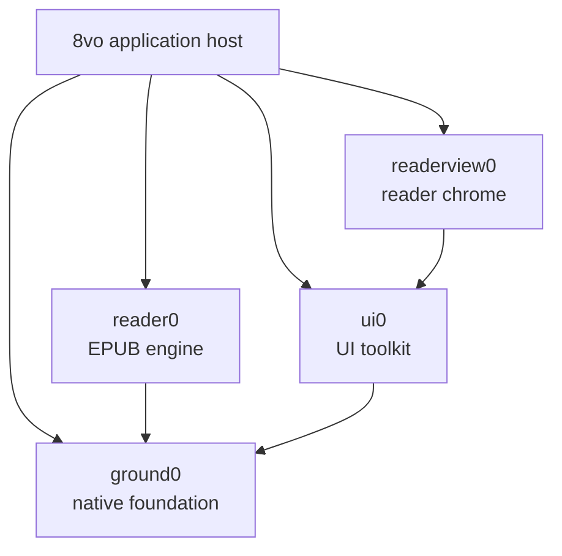

# 8vo architecture

8vo is a native reader with a format-neutral application shell. The working
product host is Windows and EPUB is its only document backend today. The
Android host is at Port 4: it compiles the same exact shared sources, opens a
deterministic EPUB through Reader0, presents Readerview0 chrome and canonical
styled pages, and supports gated tap navigation with a readable proportional
serif default.
The project does not introduce a generic document framework in anticipation of
formats that do not yet exist.

## System map



8vo compiles these libraries directly from the exact revisions recorded under
`vendor/`. The pins and bootstrap process are documented in
[DEPENDENCIES.md](../DEPENDENCIES.md).

## Responsibilities

| Component | Owns |
| --- | --- |
| **8vo** | Product lifecycle and input, the library surface, commands, persistence, document selection, rendering integration, accessibility adapters, and product cache policy; concrete Win32 production and Android native reader hosts |
| **reader0** | EPUB parsing, metadata, layout, pagination, search, selection, navigation, and canonical reader frames |
| **readerview0** | Shared reader chrome, panel and popup layout, transient interaction state, semantic records, and bounded actions |
| **ui0** | Product-neutral controls, focus and input mechanics, layout, themes, and renderer-independent draw records |
| **ground0** | Memory and OS primitives, files and atomic replacement, Unicode and text, fonts, presentation geometry, image decoding, draw commands, and software rendering |

The dependency direction is one-way. Reader0 does not depend on UI0 or
Readerview0. Readerview0 does not parse documents or perform persistent
mutations. Ground0 contains no reader-product policy.

## Application surfaces

8vo has two top-level surfaces:

- **Library** is owned entirely by 8vo. It stores a bounded, versioned catalog,
  imports and removes local books, manages thumbnails, and opens the native
  file picker.
- **Reader** combines Reader0's canonical document frame with Readerview0's
  shared reader chrome. Closing a book returns to the Library.

Reader0 supplies EPUB metadata and resource access, but it does not own the
catalog. Readerview0 supplies the open-book interface, but it does not own the
document or host persistence.

## Frame flow

Each visible reader frame follows the same path:

1. Platform input is translated into host or reader intents.
2. 8vo applies host mutations or asks Reader0 to perform a document operation.
3. Reader0 publishes a canonical frame into caller-owned bounded storage.
4. 8vo projects that frame and host state into Readerview0.
5. Readerview0 returns UI0 draw records, semantic records, and requested
   actions.
6. 8vo validates and executes those actions, then adapts reader content and UI
   records to Ground0 presentation and rendering.
7. A successful capture and presentation completes the frame.

Page navigation is gated by presentation: another page mutation cannot advance
until the accepted Reader0 frame has been captured and shown. Key repeat,
preparation scheduling, and cancellation remain platform-host policy rather than
Reader0 behavior.

## Ownership and lifetimes

- Reader state, frame storage, UI state, layout inputs, arenas, and caches are
  caller-owned.
- Cross-package strings and rows are borrowed only for the current build.
- Public boundaries use values and bounded records, not callbacks, provider
  tables, virtual interfaces, or dependency injection.
- Reader0 is consumed through `reader0.h`, and `reader0.c` is compiled exactly
  once.
- Capacity failures and unsupported states remain visible to the caller.
- No package starts hidden threads or owns process-global mutable document
  state.

## Reader state and persistence

8vo owns reading settings, saved locations, bookmarks, highlights, and notes.
Readerview0 projects this state and returns requests; it never treats a request
as a completed mutation.

Persistent records are versioned and written through Ground0's atomic-file
mechanism. Each file is replaced independently; the application does not claim
a cross-file transaction. Failed annotation mutations restore the in-memory
state and leave editable drafts available for retry.

Application data lives under `%LOCALAPPDATA%\8vo`. Migration from the former
`lectern0` directory is handled by the host and is designed to be safe and
idempotent.

## Layout and rendering

Readerview0 resolves the viewport, page surface, and content rectangle as one
layout result. The content rectangle is the authoritative input to Reader0
pagination, so chrome layout and document layout cannot silently disagree.

Reader0 owns canonical text and image rows. Ground0 owns text shaping,
presentation geometry, image decoding and resampling, draw commands, and the
software renderer. 8vo connects them and owns:

- font and renderer bindings;
- decoded-image, prepared-image, and thumbnail cache limits;
- image fit and fallback policy;
- the final Win32 backbuffer or Android native-window presentation.

The same resolved font measurements are used for pagination and rasterization.
Images remain Reader0 document resources, Ground0 decoding mechanisms, and 8vo
presentation policy.

## Platform and accessibility

8vo owns each platform's window or surface, lifecycle, input translation,
native file picker, fullscreen behavior, clipboard integration, and
accessibility adapter.

Readerview0 publishes portable semantic and focus records. 8vo exposes those
records through the Win32 MSAA object and adds its host-owned controls, such as
Close Book. Native object lifetime and execution of returned actions remain in
the application.

The Android Port 4 host remains deliberately bounded. Java owns the `Activity`
and `SurfaceView`; one caller-owned native handle owns the corresponding
`ANativeWindow`, Reader0/Readerview0 state, and copied platform-serif atlas.
Android font acquisition stays in 8vo, and the exact copied advances are used
for both Reader0 pagination and native raster placement. Touch navigation,
lifecycle, inset handling, handset content geometry, and successful
presentation are host policy. Android accessibility adaptation, a file picker,
user typography settings, and full Unicode shaping are not claimed yet. The
current milestone contract is in [`android_port4.md`](android_port4.md).

## Adding another format

A future PDF, CBR, or other backend should begin as a concrete implementation
with explicit host ownership. Shared abstractions should be extracted only
after at least two working backends demonstrate a stable common contract.

The application shell may choose between concrete backends, but Reader0 should
not gain a speculative generic provider interface merely to anticipate them.

## Build and validation

The build uses C11 with `/W4 /WX` and runs dependency and architecture guards
before compilation. The public validation entry point is:

```powershell
powershell -NoProfile -ExecutionPolicy Bypass -File scripts\run_public_smoke.ps1
```

Detailed historical decisions and regression evidence are retained in the
[engineering archive](archive/README.md). They are not part of the current
architectural contract.
