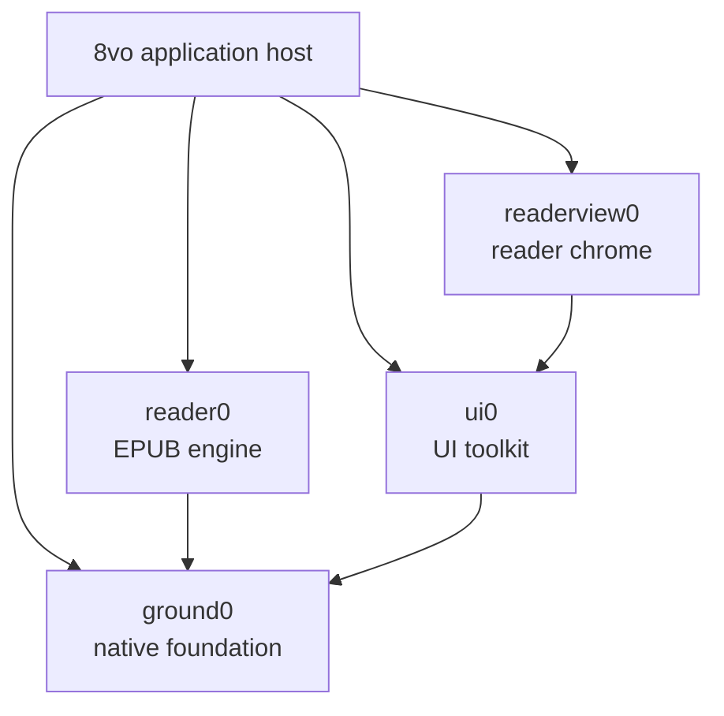

# 8vo architecture

8vo is a native reader with a format-neutral application shell. The working
product host is Windows and EPUB is its only document backend today. The
accepted Android host is at Port 6, with the current Port 7 appearance
candidate implemented and awaiting physical-device and hands-on acceptance.
It compiles the same exact shared sources, starts on an 8vo-owned bounded
library, opens its deterministic sample or multiple digest-keyed imported
EPUBs through Reader0, presents canonical borderless styled pages with
host-composited native chrome, supports
presentation-gated navigation and appearance reflow, offers host-owned global
themes and system serif/sans typography, and durably resumes each book's last
successfully presented semantic location.
The project does not introduce a generic document framework in anticipation of
formats that do not yet exist.

## System map



8vo compiles these libraries directly from the exact revisions recorded under
`vendor/`. The pins and bootstrap process are documented in
[DEPENDENCIES.md](../DEPENDENCIES.md).

## Responsibilities

| Component | Owns |
| --- | --- |
| **8vo** | Product lifecycle and input, the library surface, commands, persistence, document selection, rendering integration, accessibility adapters, and product cache policy; concrete Win32 production and Android native reader hosts |
| **reader0** | EPUB parsing, metadata, layout, pagination, search, selection, navigation, and canonical reader frames |
| **readerview0** | Shared reader chrome, panel and popup layout, transient interaction state, semantic records, and bounded actions |
| **ui0** | Product-neutral controls, focus and input mechanics, layout, themes, and renderer-independent draw records |
| **ground0** | Memory and OS primitives, files and atomic replacement, Unicode and text, fonts, presentation geometry, image decoding, draw commands, and software rendering |

The dependency direction is one-way. Reader0 does not depend on UI0 or
Readerview0. Readerview0 does not parse documents or perform persistent
mutations. Ground0 contains no reader-product policy.

## Application surfaces

8vo has two top-level surfaces:

- **Library** is owned entirely by 8vo. It stores a bounded, versioned catalog,
  imports and removes local books, and opens the native file picker. Cover and
  thumbnail policy remains future library work.
- **Reader** combines Reader0's canonical document frame with Readerview0's
  portable control/semantic projection. On Android, Port 7 asks Readerview0 for
  a distraction-free, borderless page over the full native viewport and draws
  equivalent controls in the Android host. Hidden chrome leaves the canonical
  SurfaceView at its identity transform. Visible chrome uniformly scales and
  translates that same already-rendered surface between the host controls;
  showing or hiding controls does not repaginate, redraw, or mutate the page.
  Closing a book returns to the Library.

Reader0 supplies EPUB metadata and resource access, but it does not own the
catalog. Readerview0 supplies the open-book interface, but it does not own the
document or host persistence.

## Frame flow

Each visible reader frame follows the same path:

1. Platform input is translated into host or reader intents.
2. 8vo applies host mutations or asks Reader0 to perform a document operation.
3. Reader0 publishes a canonical frame into caller-owned bounded storage.
4. 8vo projects that frame and host state into Readerview0.
5. Readerview0 returns UI0 draw records, semantic records, and requested
   actions.
6. 8vo validates and executes those actions, then adapts reader content and UI
   records to Ground0 presentation and rendering.
7. A successful capture and presentation completes the frame.

Android deliberately specializes the composition stage: Readerview0 still
supplies portable semantics and actions, while the host renders the native
controls and composes the canonical full-viewport page. This keeps pagination
and EPUB interpretation shared without forcing one platform's chrome layout
onto another platform.

Page navigation is gated by presentation: another page mutation cannot advance
until the accepted Reader0 frame has been captured and shown. Key repeat,
preparation scheduling, and cancellation remain platform-host policy rather than
Reader0 behavior.

Port 7 extends the same gate to appearance generations and canonical reflow.
Java coalesces rapid preference requests, native state permits only one page,
appearance, or reflow generation to await presentation, and the durable
appearance is not advanced until the native window has posted it successfully.

## Ownership and lifetimes

- Reader state, frame storage, UI state, layout inputs, arenas, and caches are
  caller-owned.
- Cross-package strings and rows are borrowed only for the current build.
- Public boundaries use values and bounded records, not callbacks, provider
  tables, virtual interfaces, or dependency injection.
- Reader0 is consumed through `reader0.h`, and `reader0.c` is compiled exactly
  once.
- Capacity failures and unsupported states remain visible to the caller.
- No package starts hidden threads or owns process-global mutable document
  state.

## Reader state and persistence

8vo owns reading settings, saved locations, bookmarks, highlights, and notes.
Readerview0 projects this state and returns requests; it never treats a request
as a completed mutation.

Persistent records are versioned and atomically replaced through the concrete
host: the Windows host uses Ground0's atomic-file mechanism, while Android
uses app-private same-directory temporary files, descriptor synchronization,
and atomic replacement where supported. Each file is replaced independently;
the application does not claim a cross-file transaction. Failed annotation
mutations restore the in-memory state and leave editable drafts available for
retry.

Android Port 7 stores exactly one global appearance in
`<files>/port7/appearance.v1`, separately from the Port 6 catalog and per-book
locations. The current version-2 fixed record has an explicit version, shape,
size bound, and CRC32 checksum. Missing or corrupt appearance state falls back
to Paper, Literary system serif, 16sp, Classic spacing, Balanced width,
Publisher alignment, theme-safe publisher colors, and reduced motion off. The
exact version-1 all-default tuple migrates its former 18sp default to version 2
at 16sp. Version 1 stored no separate user-intent bit, so every other
version-1 tuple and any version-2 18sp choice remains unchanged. A failed
migration write leaves the valid old record available for
retry. Per-book appearance overrides are deliberately absent. Appearance
publication requires a synchronized same-directory temporary file and
`ATOMIC_MOVE` with `REPLACE_EXISTING`; unsupported or failed atomic publication
preserves the prior record and reports failure rather than falling back to a
non-atomic replace.

Windows application data lives under `%LOCALAPPDATA%\8vo`. Migration from
the former `lectern0` directory is handled by the Windows host and is designed
to be safe and idempotent. Android uses its package-private files directory.

## Layout and rendering

Readerview0 resolves the viewport, page surface, and content rectangle as one
layout result. The content rectangle is the authoritative input to Reader0
pagination, so presentation and document layout cannot silently disagree. The
Android Port 7 distraction-free projection resolves one borderless canonical
page against the full native viewport. Transient host-chrome transforms never
feed a smaller rectangle back into pagination.

Reader0 owns canonical text and image rows. Ground0 owns text shaping,
presentation geometry, image decoding and resampling, draw commands, and the
software renderer. 8vo connects them and owns:

- font and renderer bindings;
- decoded-image, prepared-image, and thumbnail cache limits;
- image fit and fallback policy;
- the final Win32 backbuffer or Android native-window presentation.

The same resolved font measurements are used for pagination and rasterization.
Images remain Reader0 document resources, Ground0 decoding mechanisms, and 8vo
presentation policy.

Publisher-aligned rows use one allocation-free 8vo justification planner from
`code/octavo_reader_justification.h` in both the Windows and Android raster
paths. It consumes validated Reader0 rows and presentation metrics; it does not
interpret EPUB content or paginate. Ragged-right mode retains natural word
spacing. Windows theme IDs, labels, UI0 mappings, derived reader roles, and
8vo search/highlight extensions similarly live in the stable shared
`octavo_theme` catalog. Android's six semantic palettes remain independently
tuned host policy, because cross-platform reuse does not require identical
platform colors.

Port 7 acquires Android's generic serif or sans-serif family in the host and
copies regular, bold, italic, and bold-italic atlas metrics into caller-owned
native state. An immutable one-entry typography cache reuses the atlas for the
same family, resolved pixel size, and spacing tuple. No font asset is bundled,
embedded EPUB fonts remain disabled, and device font metrics may differ. The
portability promise is therefore the semantic location, not identical page
numbering across devices.

Before a layout-affecting appearance mutation, 8vo retains the last
successfully presented Reader0 spine/byte anchor. It supplies the new font
metrics and content geometry to Reader0 and invokes Reader0's public canonical
location-navigation path to publish the page containing that anchor. The host
verifies containment only after the native window posts the frame. Theme-only
updates and overlay-chrome visibility do not change page geometry or
pagination.

Android Debug native compilation keeps symbols but uses `-O2`. First-frame
scheduling opens and restores the requested page before deferring whole-book
location summaries to bounded post-presentation work. Terminal summary
failure is visible but nonfatal, and presentation exhaustion cancels further
deferred polling. Native diagnostics record create-to-successful-frame time
without recording titles or content.
Before constructing the reader hierarchy, the Activity synchronously installs
a target-theme transition cover; it removes that cover only after a successful
native page and two Java frames, preventing the SurfaceView's initial black
layer from becoming visible.

## Platform and accessibility

8vo owns each platform's window or surface, lifecycle, input translation,
native file picker, fullscreen behavior, clipboard integration, and
accessibility adapter.

Readerview0 publishes portable semantic and focus records. 8vo exposes those
records through the Win32 MSAA object and adds its host-owned controls, such as
Close Book. Native object lifetime and execution of returned actions remain in
the application.

The Android Port 7 implementation candidate remains deliberately bounded.
Java owns the Activity, library and `OctavoAppearancePanel` settings surfaces,
standard document picker, digest-keyed managed copies, versioned catalog,
global appearance record, removal policy, system typography acquisition,
accessibility adapter, target-theme transition cover, native chrome controls,
SurfaceView scale/translation, and SurfaceView lifecycle. One caller-owned
native handle owns the corresponding ANativeWindow, Reader0/Readerview0 state,
copied four-style glyph atlas, resolved semantic palette, canonical-page state,
and presentation gates.

The accepted Port 6 catalog remains capped at 64 entries and 128 KiB; each
import remains capped at 512 MiB. Duplicate bytes reopen the existing SHA-256
entry, while removal deletes only the app-private copy after the catalog
commit. Appearance persistence does not alter those catalog records.

8vo persists one Reader0 spine/page-start byte per book only after successful
presentation. Writes are debounced during reading and synchronously flushed at
lifecycle, surface, and reader teardown. Reader0's existing canonical location
navigation reconstructs the same page under the same layout and the page
containing the presented semantic anchor after a reflow. Android does not
reimplement pagination. A corrupt catalog falls back to the deterministic
sample, and a valid Port 5 imported session is migrated once when no Port 6
catalog exists.

The Port 7 custom-view accessibility adapter publishes a bounded virtual tree
for page content, previous page, next page, and progress. It maps
Readerview0's portable semantic records to Android nodes and actions, keeps a
stable focus order, and emits page-change events only after successful
presentation. It establishes the bridge pattern but does not yet claim full
publication semantics or accepted TalkBack behavior.

Android font acquisition, theme policy, touch navigation, overlay chrome,
lifecycle, inset handling, handset content geometry, library/catalog,
document selection, persistence, removal, accessibility adaptation, and
successful-presentation policy remain host responsibilities. Thumbnails,
cover-library expansion, table of contents, full-text search, text selection,
bookmarks/highlights/notes workspace, per-book appearances, embedded fonts,
complete publication accessibility, full Unicode shaping, and synchronization
remain deferred. The current implementation and pending acceptance contract is
in
[`android_port7.md`](android_port7.md).

## Adding another format

A future PDF, CBR, or other backend should begin as a concrete implementation
with explicit host ownership. Shared abstractions should be extracted only
after at least two working backends demonstrate a stable common contract.

The application shell may choose between concrete backends, but Reader0 should
not gain a speculative generic provider interface merely to anticipate them.

## Build and validation

The build uses C11 with `/W4 /WX` and runs dependency and architecture guards
before compilation. The public validation entry point is:

```powershell
powershell -NoProfile -ExecutionPolicy Bypass -File scripts\run_public_smoke.ps1
```

Detailed historical decisions and regression evidence are retained in the
[engineering archive](archive/README.md). They are not part of the current
architectural contract.

The current API 36 x86_64 candidate passed 27/27 ordered instrumentation tests,
both Android debug ABIs, the strict Windows 8vo build and 7/7 public smokes, and
unchanged re10 qualification. An ignored local Gardens of the Moon Resume repro
measured 411ms from ADB tap to the observed saved page and 220ms from native
creation to successful presentation, with no black/near-black app-bound pixels
in the sampled transition frames. These emulator measurements are regression
evidence, not a release SLA. The earlier physical iQOO 23/23 record belongs to
the superseded reserved-geometry candidate; the current borderless/performance
APK still requires its physical iQOO rerun and hands-on acceptance.
